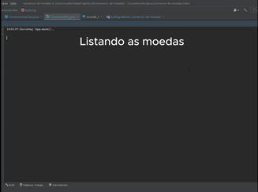
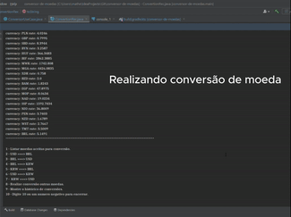
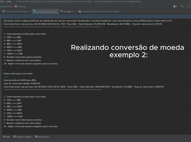
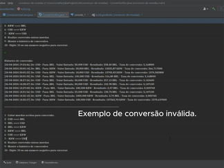
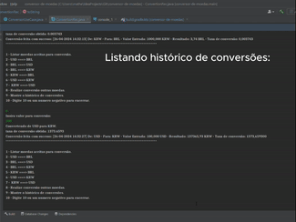

# Resumo do projeto
Desenvolver um Conversor de Moedas que ofereça interação textual (via console) com os usuários, proporcionando no mínimo 6 opções distintas de conversões de moedas em um menu. A taxa de conversão não será estática, mas sim dinamicamente obtida por meio de uma API, garantindo dados precisos e em tempo real para uma experiência mais atualizada e eficaz.

> OBS: Para que o sistemas execute corretamente, necessário configurar as variáveis e seus respectivos valores como:
> - `ExchangeListUri`:  https<nolink>://v6.exchangerate-api.com/v6/API_KEY/latest/USD
> - `PairConversionUri`: https<nolink>://v6.exchangerate-api.com/v6/API_KEY/pair/%s/%s/
> - `API_KEY`: Você pode obter chave para a conexão clicando neste [link](https://app.exchangerate-api.com/dashboard)

## Configuração Banco de dados

- `user`: **postgres**
- `password`: **1234** (caso não queira colocar senha não há necessidades **Apenas para finalidade de teste**)
- `nome da base`: **br-com-conversion**

> OBS2: A integração com o banco de dados foi para aperfeiçoar o Challenge oferecido e adicionar funcionalidades que representam melhor o mundo real.

## 🔨 Funcionalidades do projeto

- `Funcionalidade 1` `Listar moedas`: Nosso sistema carregará de uma API de terceiros uma lista de moedas e seus respectivo valores atrelados ao Dólar. Nisso o usuário terá a opção de visualização das moedas disponíveis.

> Gif da funcionalidade de listar moedas: 
> 
>   

- `Funcionalidade 2` `Conversão do valor`: O sistema aceitará duas moedas, em que uma passará por uma conversão de valor por meio do calculo da multiplicação da taxa de conversão x Valor. Nesta funcionalidade o sistema tentará o valor atualizado da taxa de conversão entre as duas moedas passadas. Caso não consiga, realizará o cálculo de acordo com o valor histórico obtido no começo da inicialização.

### Testes realizados: 

Exemplo 1: 

Exemplo 2:

Exemplo 3:

- `Funcionalidade 3` `Visualizar histórico de conversão`: Nesta funcionalidade o usuário poderá visualizar todas as suas conversões realizadas na aplicação. Será exibida uma lista no console com todas as conversões. Sistema foi integrado com um banco de dados Postgres para salvamento e carregamento dos registros realizados.
  
> Exemplo de listagem das conversões realizadas:

## ✔️ Técnicas e tecnologias utilizadas

- ``Java 17``
- ``InteliJ IDEA``
- ``Paradigma de orientação a objetos``
- ``Gradle``
- ``Postgres``

## 📁 Acesso ao projeto
Você pode acessar os arquivos do projeto clicando [aqui](https://github.com/matheusfy/conversor-de-moedas/tree/main/src/main/java/br/com).
